# Bilgisayarla Görü 
**Nokta İşlemleri · Histogram Analizi · Kontrast Germe · Histogram Eşitleme · Gamma Düzeltme**

Bu çalışma, üç farklı gri seviye görüntü üzerinde temel görüntü iyileştirme tekniklerinin uygulanması ve karşılaştırılması üzerine hazırlanmıştır. Amaç, görüntü parlaklık–kontrast yapısını anlamak, histogram tabanlı analizler yardımıyla ton dağılımını incelemek ve özellikle karanlık/gölge bölgelerde detay görünürlüğünü artırmaktır.

---

## 📌 Kullanılan Görüntüler

| Görüntü 1 | Görüntü 2 | Görüntü 3 |
|----------|-----------|-----------|
|  |  |  |

---

## 🔹 Soru 1 – Nokta İşlemleri Sonuçları

| Görüntü 1 | Görüntü 2 | Görüntü 3 |
|----------|-----------|-----------|
| 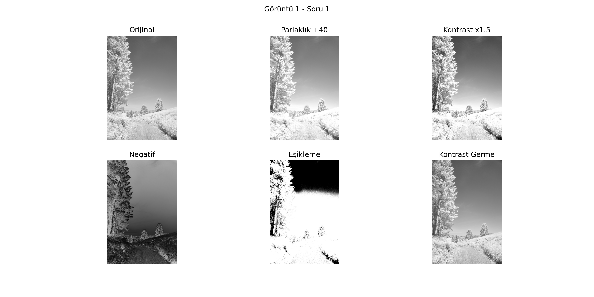 | 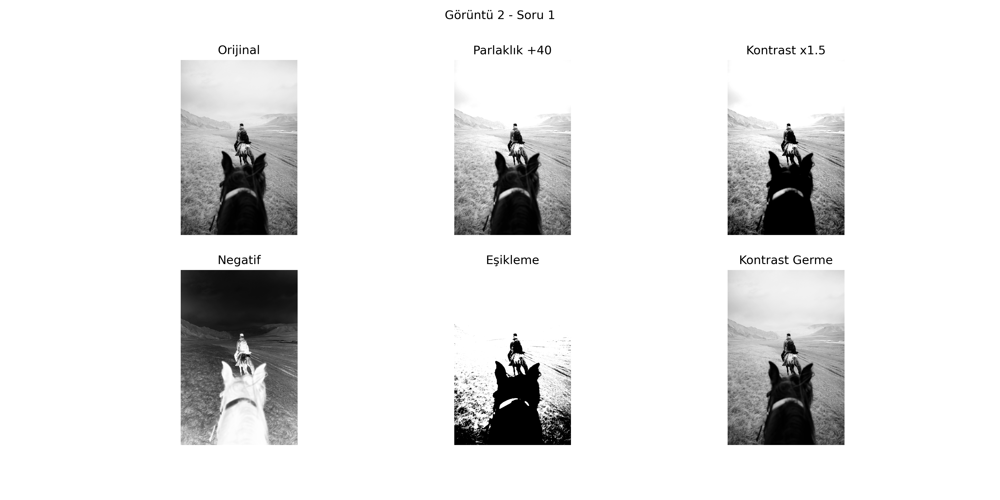 |  |

**Yorum:**  
- Parlaklık artırma görüntüyü genel olarak aydınlatmıştır.  
- Kontrast artırma koyu ve açık alanları belirginleştirmiştir.  
- Negatif alma, görüntünün ışık yoğunluğunu tersine çevirmiştir.  
- Eşikleme sayesinde nesne-arka plan ayrımı netleşmiştir.

---

## 📊 Soru 2 – Histogram ve Entropi Analizi

| Görüntü | Histogram |
|--------|-----------|
| Görüntü 1 | 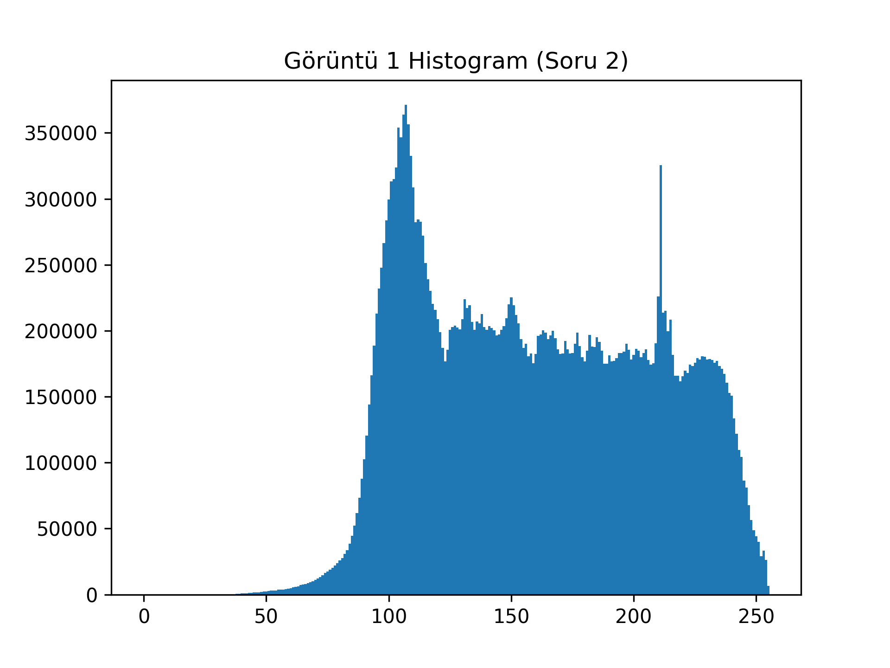 |
| Görüntü 2 | 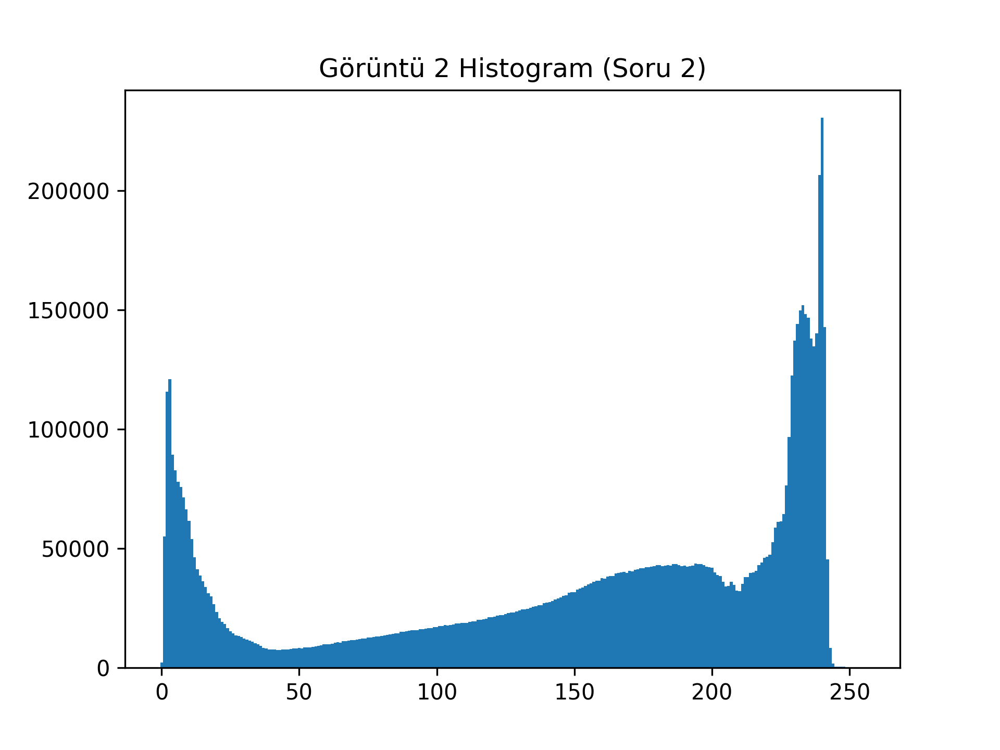 |
| Görüntü 3 |  |

**Yorum:**  
- Histogram eğrileri tonal dağılım hakkında bilgi verir.  
- Entropi değeri yüksek olan görüntüler daha fazla detay içerir.

---

## 🔸 Soru 3 – Kontrast Germe

| Görüntü 1 | Görüntü 2 | Görüntü 3 |
|----------|-----------|-----------|
| 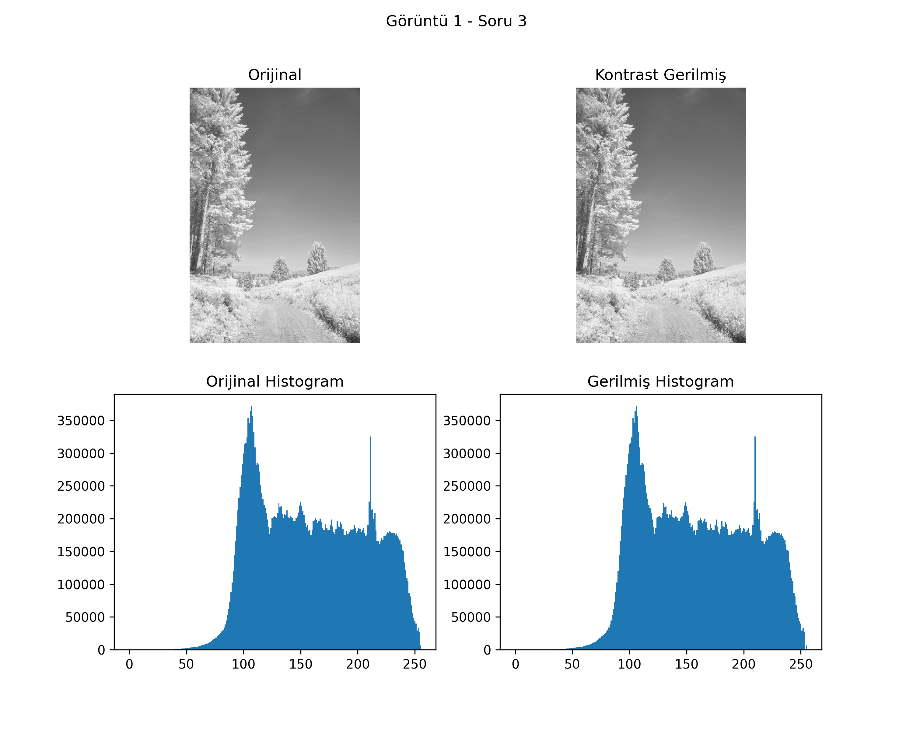 | 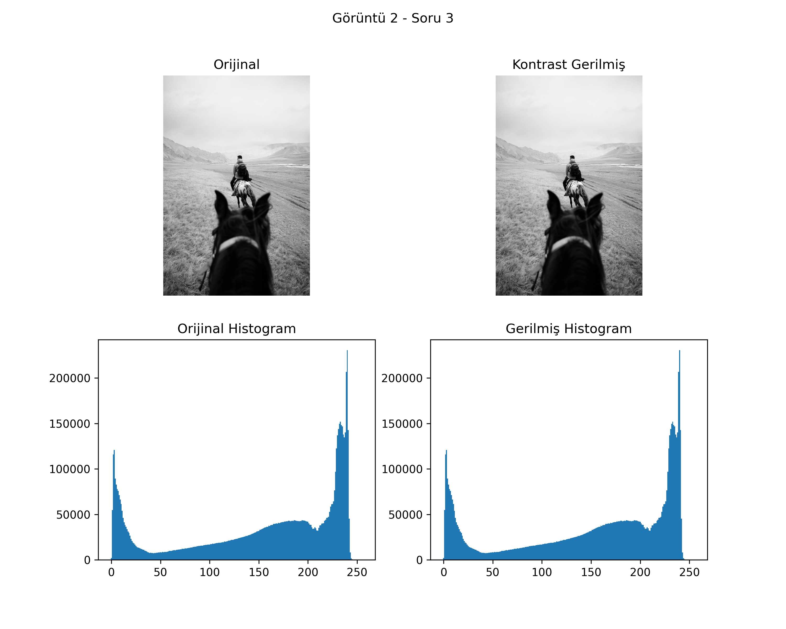 | 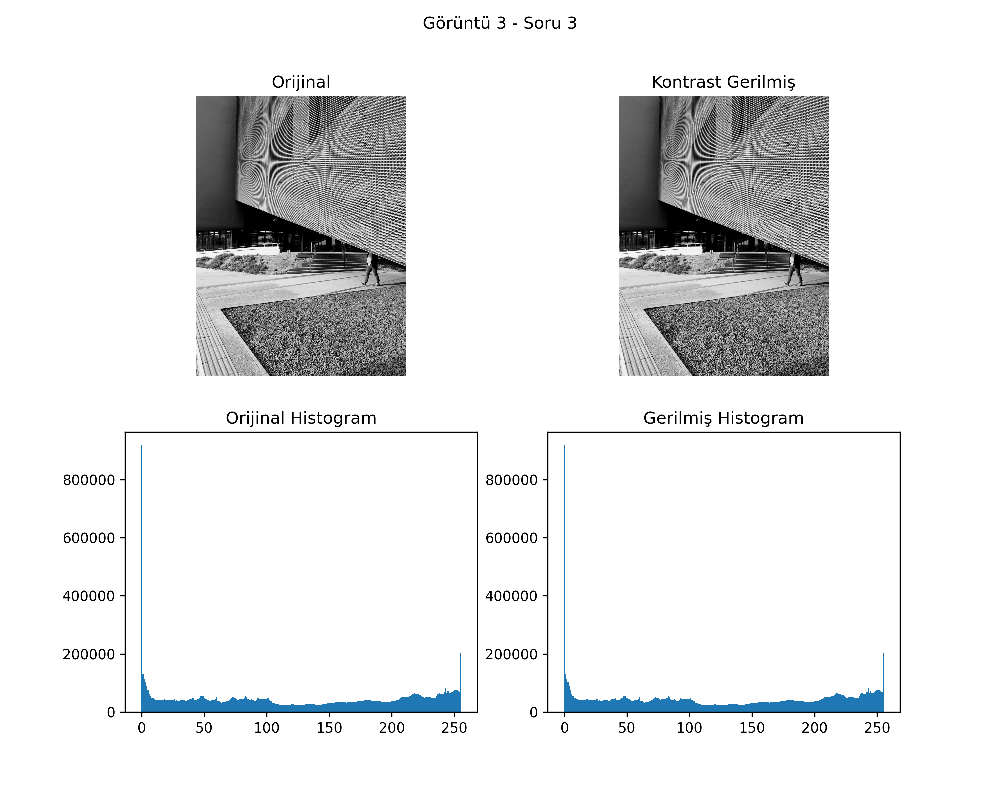 |

**Yorum:**  
Kontrast germe, görüntüdeki koyu ve açık bölgelerin aralığını genişletmiş ve detayların görünürlüğünü artırmıştır.

---

## 🎛️ Soru 4 – Histogram Eşitleme

| Görüntü 1 | Görüntü 2 | Görüntü 3 |
|----------|-----------|-----------|
| 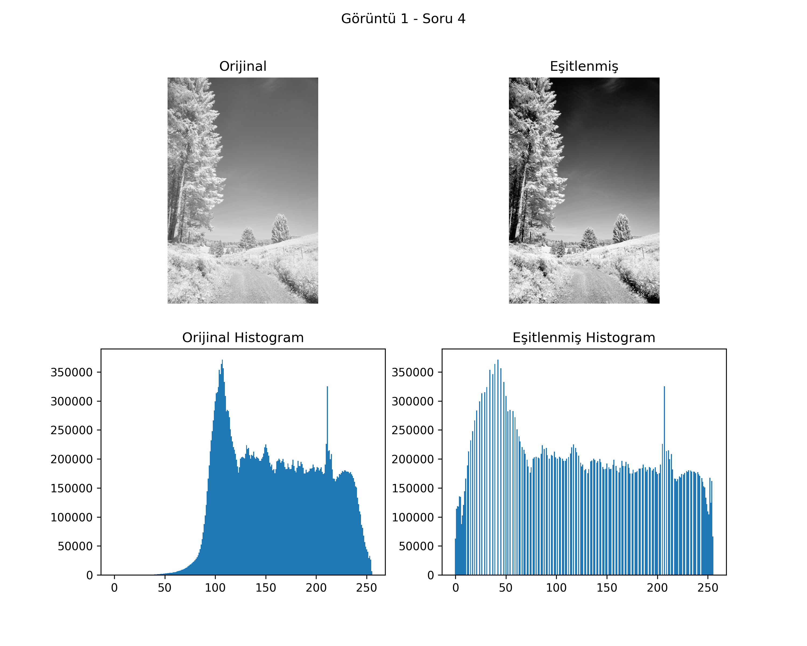 | 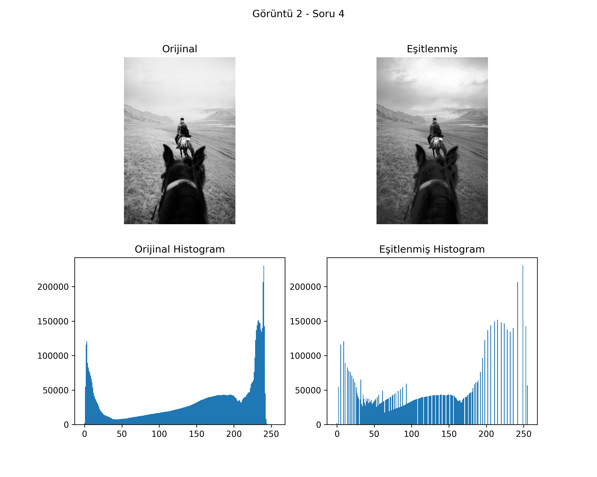 | 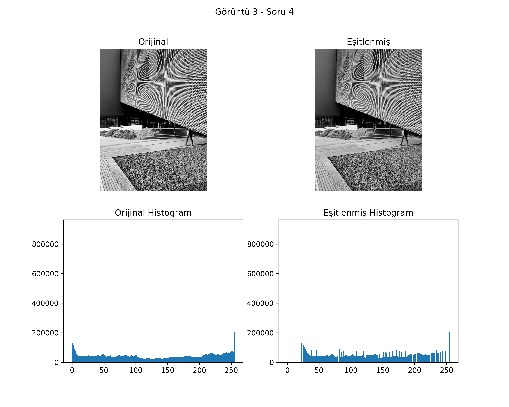 |

**Yorum:**  
Histogram eşitleme gölgeli alanlarda detayları ortaya çıkarmıştır.

---

## ⚡ Soru 5 – Gamma Düzeltme

| Görüntü 1 | Görüntü 2 | Görüntü 3 |
|----------|-----------|-----------|
| 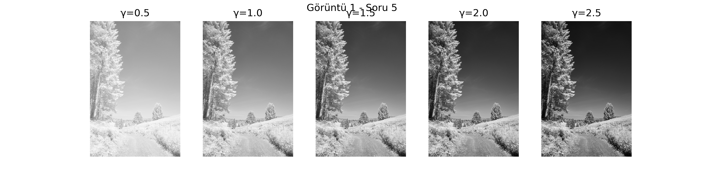 | 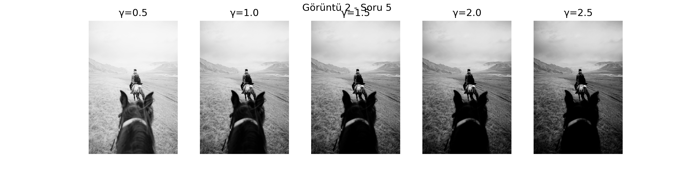 | 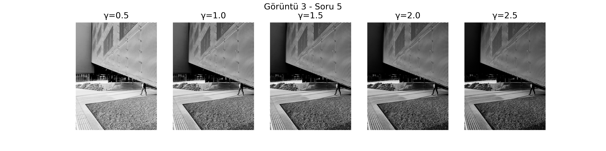 |

**Yorum:**  
- γ < 1 → Koyu bölgeler aydınlatılmıştır.  
- γ > 1 → Parlak bölgeler bastırılmıştır.  

Bu işlem, insan gözünün logaritmik parlaklık algısına uygun bir ton düzenlemesi sağlar.

---

## 💎 Genel Sonuç

Bu çalışma sonucunda:

- Nokta işlemleri temel ton manipülasyonları sağlar.  
- Histogram analizleri görüntüdeki ton dengesini anlamaya yardımcı olur.  
- Kontrast germe, dinamik aralığı genişleterek görüntüyü daha okunaklı hale getirir.  
- Histogram eşitleme, gölge bölgelerden daha fazla bilgi çıkarır.  
- Gamma düzeltme, insan görsel algısına uygun bir parlaklık kontrolü sunar.

Görüntü işleme yöntemleri doğru seçildiğinde, **görsel kalite ve detay algısı dramatik şekilde iyileşebilir.**

---

## 👩‍💻 Hazırlayan
**Büşra Mina AL**  
Yapay Zeka Mühendisliği

